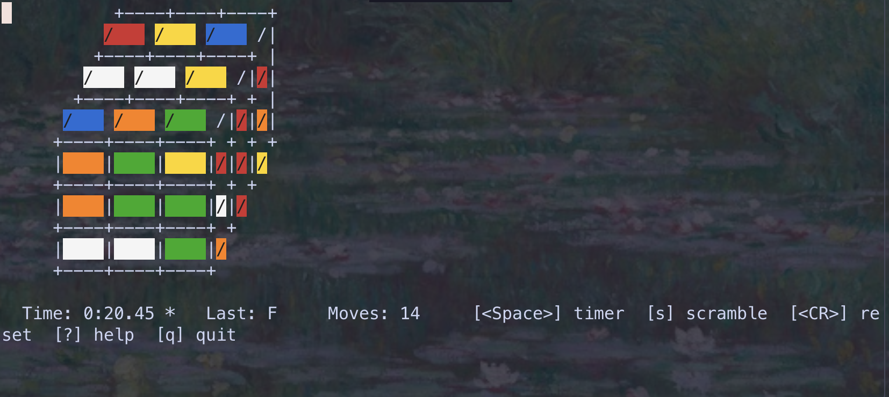

# rubiks-cube.nvim

A playable Rubik's cube inside Neovim — isometric ASCII render, full move set in Singmaster notation, a timer, and best-time persistence.



## Requirements

- Neovim **0.10+** (uses `vim.uv`)
- `termguicolors` enabled (recommended; falls back to cterm approximations otherwise)

## Installation

### lazy.nvim

```lua
{
  "xiangnongWu2233/rubiks-cube.nvim",
  cmd = "Rubikscube",
  opts = {},  -- or pass any config table; see below
}
```

### packer.nvim

```lua
use {
  "xiangnongWu2233/rubiks-cube.nvim",
  cmd = "Rubikscube",
  config = function() require("rubikscube").setup({}) end,
}
```

## Usage

```vim
:Rubikscube
```

## Features

- All 18 standard moves: face turns (`U D L R F B`) + cube rotations (`x y z`), each in CW/CCW form
- Built-in timer with pause/resume on `<Space>`
- Solve detection — flash + popup with time, move count, and personal best
- Persistent best time stored at `stdpath("data")/rubikscube/best.json`
- Floating window by default; configurable to open in current buffer, split, or vsplit
- Fully configurable keymaps; any binding can be disabled with `false`

Inside the cube buffer:

| Key | Action |
|---|---|
| `u` / `U` | U face CW / CCW |
| `d` / `D` | D face CW / CCW |
| `l` / `L` | L face CW / CCW |
| `r` / `R` | R face CW / CCW |
| `f` / `F` | F face CW / CCW |
| `b` / `B` | B face CW / CCW |
| `x` / `X` | rotate whole cube around R axis |
| `y` / `Y` | rotate whole cube around U axis |
| `z` / `Z` | rotate whole cube around F axis |
| `<Space>` | start / pause timer |
| `s` | scramble (default 20 random moves) |
| `<CR>` | reset to solved (clears timer) |
| `?` | toggle help popup |
| `q` | quit |

Lowercase = clockwise face turn (Singmaster notation); uppercase = prime (counter-clockwise).

## Configuration

Default:

```lua
require("rubikscube").setup({
  keymaps = {
    -- Face turns: configure the lowercase letter; uppercase auto-binds the prime.
    U = "u", D = "d", L = "l", R = "r", F = "f", B = "b",
    -- Cube rotations: same convention.
    x = "x", y = "y", z = "z",
    -- Actions.
    scramble = "s",
    reset    = "<CR>",
    timer    = "<Space>",
    quit     = "q",
    help     = "?",
    -- Any entry above may be set to `false` to skip the binding entirely.
  },
  scramble_length = 20,   -- moves applied by the scramble action
  persist_best    = true, -- set false to disable writing best.json (reads still work)
  open_in         = "float", -- "float" | "current" | "split" | "vsplit"
})
```

## Colors

Sticker colors are exposed as the highlight groups:

```
RubiksW   white
RubiksY   yellow
RubiksO   orange
RubiksR   red
RubiksG   green
RubiksB   blue
```

Override any of them from your colorscheme — they're set with `default = true`, so user overrides survive a plugin reload:

```vim
highlight RubiksO guibg=#ff8800 guifg=#000000
```

## Commands

| Command | Description |
|---|---|
| `:Rubikscube` | Open the cube (no-op if a cube is already open) |
