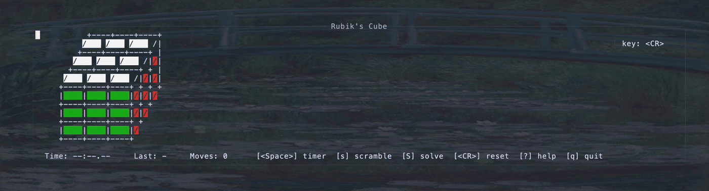

# rubiks-cube.nvim

A playable Rubik's cube inside Neovim — isometric ASCII render, full move set in Singmaster notation, a timer, and best-time persistence.



## Requirements

- Neovim **0.10+** (uses `vim.uv`)
- `termguicolors` enabled (recommended; falls back to cterm approximations otherwise)
- **Optional** — [`kociemba`](https://github.com/muodov/kociemba) CLI on `$PATH`, required only for the auto-solve feature (`S` / `:RubikscubeSolve`). Install with one of:

  ```sh
  pipx install kociemba          # recommended: isolated venv
  uv tool install kociemba       # if you use uv
  pip install kociemba           # fallback
  ```

  Run `:checkhealth rubikscube` to verify your setup.

## Installation

### lazy.nvim

```lua
{
  "xiangnongWu2233/rubiks-cube.nvim",
  cmd = "Rubikscube",
  opts = {},  -- or pass any config table; see below
}
```

### packer.nvim

```lua
use {
  "xiangnongWu2233/rubiks-cube.nvim",
  cmd = "Rubikscube",
  config = function() require("rubikscube").setup({}) end,
}
```

## Usage

```vim
:Rubikscube
```

## Features

- All 18 standard moves: face turns + cube rotations, each in CW/CCW form
- Built-in timer with pause/resume
- Solve detection — flash + popup with time, move count, and personal best
- Persistent best time stored at `stdpath("data")/rubikscube/best.json`
- Optional auto-solve via the external `kociemba` CLI — see the [Auto-solve](#auto-solve) section

## Controls

| Key | Action |
|---|---|
| `u` / `U` | U face CW / CCW |
| `d` / `D` | D face CW / CCW |
| `l` / `L` | L face CW / CCW |
| `r` / `R` | R face CW / CCW |
| `f` / `F` | F face CW / CCW |
| `b` / `B` | B face CW / CCW |
| `x` / `X` | rotate whole cube around R axis |
| `y` / `Y` | rotate whole cube around U axis |
| `z` / `Z` | rotate whole cube around F axis |
| `<Space>` | start / pause timer |
| `s` | scramble (default 20 random moves) |
| `S` | auto-solve (requires `kociemba` — see [Auto-solve](#auto-solve)) |
| `<CR>` | reset to solved (clears timer) |
| `?` | toggle help popup |
| `q` | quit |

Lowercase = clockwise face turn (Singmaster notation); uppercase = prime (counter-clockwise).

## Auto-solve

Press `S` (or `:RubikscubeSolve`) to animate a full solve of the current cube state. The plugin shells out to the external `kociemba` CLI ([install above](#requirements)) — Herbert Kociemba's two-phase algorithm, ~20 moves per solution, computed in milliseconds.

Tempo defaults to 200 ms per move; tune via `solver.tempo_ms` in `setup()`. Pressing any face key during the animation cancels it and lets you take over. If `kociemba` isn't on `$PATH`, `S` shows a notification with install instructions — `:checkhealth rubikscube` will report what's missing.

## Configuration

Default:

```lua
require("rubikscube").setup({
  keymaps = {
    -- Face turns: configure the lowercase letter; uppercase auto-binds the prime.
    U = "u", D = "d", L = "l", R = "r", F = "f", B = "b",
    -- Cube rotations: same convention.
    x = "x", y = "y", z = "z",
    -- Actions.
    scramble = "s",
    reset    = "<CR>",
    timer    = "<Space>",
    quit     = "q",
    help     = "?",
    solve    = "S",  -- auto-solve via external `kociemba`
    -- Any entry above may be set to `false` to skip the binding entirely.
  },
  scramble_length = 20,   -- moves applied by the scramble action
  persist_best    = true, -- set false to disable writing best.json (reads still work)
  open_in         = "float", -- "float" | "current" | "split" | "vsplit"
  solver = {
    tempo_ms = 200, -- delay between animated moves during auto-solve
  },
})
```

## Colors

Sticker colors are exposed as the highlight groups:

```
RubiksW   white
RubiksY   yellow
RubiksO   orange
RubiksR   red
RubiksG   green
RubiksB   blue
```

Override any of them from your colorscheme — they're set with `default = true`, so user overrides survive a plugin reload:

```vim
highlight RubiksO guibg=#ff8800 guifg=#000000
```

## Commands

| Command | Description |
|---|---|
| `:Rubikscube` | Open the cube (no-op if a cube is already open) |
| `:RubikscubeSolve` | Start the auto-solve animation on the open cube. No-op (with a warning) if no cube is open or if `kociemba` isn't installed. |
| `:checkhealth rubikscube` | Diagnose plugin requirements: Neovim version, `termguicolors`, and the optional `kociemba` CLI. |
